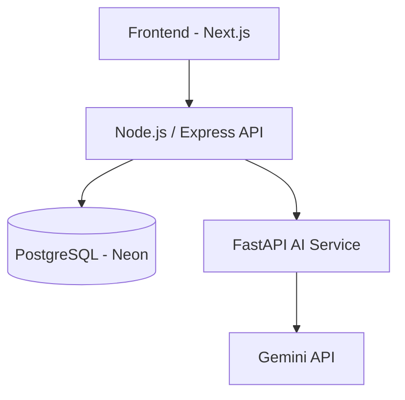

# FinSight AI

An AI-powered personal finance management app. Track transactions, get AI-generated 
spending insights, and ask questions about your finances in plain English — with 
answers grounded in your real transaction data, not hallucinated by the AI.

## Features

- 🔐 JWT-based authentication with refresh token rotation
- 💰 Full transaction management — add, edit, delete, filter, paginate
- 📄 CSV bank statement import
- 🤖 AI-powered transaction categorization (Gemini API)
- 📊 AI-generated weekly/monthly financial insights, spending anomalies, and suggestions
- 💬 Natural-language financial queries ("How much did I spend on food last month?") 
  — answers are computed from real database queries, never hallucinated by the LLM
- 📈 Dashboard with spending trends and category breakdowns

## Architecture



The Node/Express API is the single source of truth for all data. The FastAPI 
service is stateless — it never touches the database directly. It receives 
aggregated data from Node, calls Gemini, and returns structured responses. This 
means AI features degrade gracefully to rule-based fallbacks if Gemini is 
unavailable or rate-limited, without the app going down.

## Tech Stack

**Frontend:** Next.js 14 (App Router), TypeScript, TailwindCSS, shadcn/ui, Recharts

**Backend API:** Node.js, Express, TypeScript, Prisma ORM, PostgreSQL, JWT, Zod

**AI Service:** Python, FastAPI, Pydantic, Google Gemini API

**Infra:** Docker, Docker Compose, Neon (managed PostgreSQL)

## Project Structure

## Project Structure

```
FinSight-AI/
├── backend/
│   ├── apps/
│   │   ├── api/              # Node.js/Express REST API
│   │   └── ai-service/       # Python/FastAPI AI microservice
│   ├── docker-compose.yml
│   └── README.md             # Backend-specific setup and API docs
└── frontend/
    ├── src/
    └── README.md             # Frontend-specific setup

README.md                     # You are here
```


## Getting Started

### Prerequisites

- Docker Desktop
- Node.js 18+ (for frontend dev outside Docker)
- A Google Gemini API key ([get one here](https://ai.google.dev/))
- A PostgreSQL database (this project uses [Neon](https://neon.tech), but any 
  Postgres instance works)

### 1. Clone the repo

```bash
git clone https://github.com/dhruvsorout/FinSight-AI.git
cd FinSight-AI
```

### 2. Set up environment variables

Copy the example env files and fill in your real values:

```bash
cp backend/apps/api/.env.example backend/apps/api/.env
cp backend/apps/ai-service/.env.example backend/apps/ai-service/.env
cp frontend/.env.example frontend/.env.local
```

Required values:
- `backend/apps/api/.env` → `DATABASE_URL` (your Postgres/Neon connection string), 
  JWT secrets
- `backend/apps/ai-service/.env` → `GEMINI_API_KEY`
- `frontend/.env.local` → `NEXT_PUBLIC_API_URL=http://localhost:3000`

### 3. Run the backend

```bash
cd backend
docker compose up --build
```

This starts the Node API (port 3000) and FastAPI AI service (port 8000), applies 
Prisma migrations, and seeds demo data on first run only.

**Demo login:**
- Email: `demo@finsight.ai`
- Password: `DemoPass123!`

### 4. Run the frontend

```bash
cd frontend
npm install
npm run dev
```

Visit `http://localhost:3001` (or whichever port Next.js starts on).

For detailed API documentation and endpoint contracts, see 
[`backend/README.md`](./backend/README.md).

## Known Limitations

- Demo credentials are pre-filled on the login page for evaluation convenience — 
  not representative of production auth practices
- AI features (categorization, insights, natural-language query) fall back to 
  rule-based logic if the Gemini free-tier rate limit is hit
- The natural-language query feature currently supports filter + single-aggregation 
  questions well (e.g. "how much did I spend on X"); grouped ranking questions 
  (e.g. "which category did I spend the most on") are a work in progress
- No automated test suite yet


## More details:

For a detailed security and architecture review of this project, see [docs/AUDIT.md](./docs/AUDIT.md).

## License

This project is for portfolio/educational purposes.
